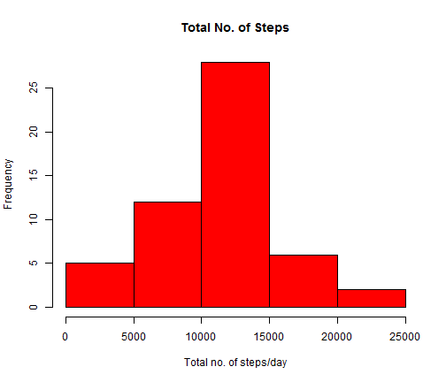
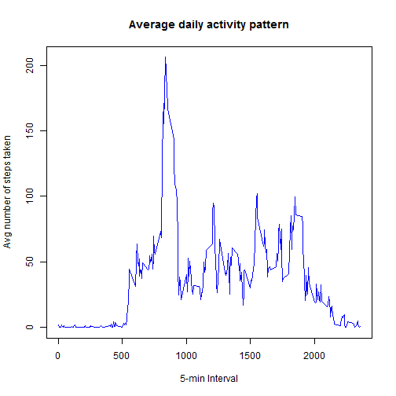
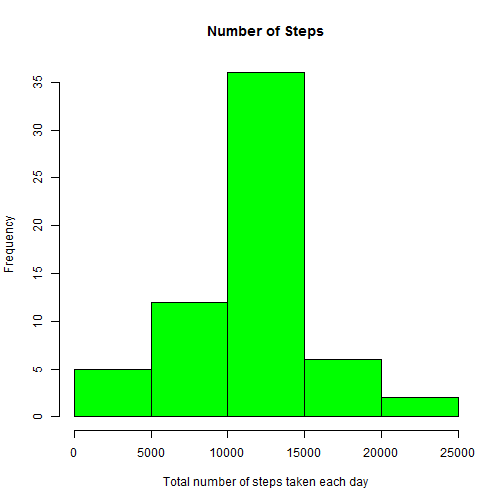

# Reproducible Research: Peer Assessment 1


## Loading and preprocessing the data

Show any code that is needed to

1. Load the data (i.e. read.csv())
2. Process/transform the data (if necessary) into a format suitable for your analysis
  
  


```r

# Reading the CSV file into R
activity = read.csv("activity.csv")

# Modifying the Date column
activity$date <- strptime(activity$date, "%Y-%m-%d")

# Creating new Dataset that does not have NAs
activity_woNA = na.omit(activity)
```


## What is mean total number of steps taken per day?

For this part of the assignment, you can ignore the missing values in the dataset.

1. Make a histogram of the total number of steps taken each day
2. Calculate and report the mean and median total number of steps taken per day
  
  


```r
library(plyr)

# Transforming the Data to find
Totalperday <- ddply(activity_woNA, .(date), summarise, steps = sum(steps))
hist(Totalperday$steps, main = "Total No. of Steps", xlab = "Total no. of steps/day", 
    col = "red")
```

 

```r

mean(Totalperday$steps)
```

```
## [1] 10766
```

```r
median(Totalperday$steps)
```

```
## [1] 10765
```


## What is the average daily activity pattern?

1. Make a time series plot (i.e. type = "l") of the 5-minute interval (x-axis) and the average number of steps taken, averaged across all days (y-axis)
2. Which 5-minute interval, on average across all the days in the dataset, contains the maximum number of steps?  
  
  


```r

AverageByInterval <- ddply(activity_woNA, .(interval), summarise, steps = mean(steps))

plot(AverageByInterval$interval, AverageByInterval$steps, type = "l", col = "blue", 
    xlab = "5-min Interval", ylab = "Avg number of steps taken", main = "Average daily activity pattern")
```

 

```r


AverageByInterval$interval[which.max(AverageByInterval$steps)]
```

```
## [1] 835
```

```r


AverageByInterval$AvgSteps = AverageByInterval$steps
AverageByInterval$steps = NULL
```


## Imputing missing values

Note that there are a number of days/intervals where there are missing values (coded as NA). The presence of missing days may introduce bias into some calculations or summaries of the data.

1. Calculate and report the total number of missing values in the dataset (i.e. the total number of rows with NAs)
2. Devise a strategy for filling in all of the missing values in the dataset. The strategy does not need to be sophisticated. For example, you could use the mean/median for that day, or the mean for that 5-minute interval, etc.
3. Create a new dataset that is equal to the original dataset but with the missing data filled in.
4. Make a histogram of the total number of steps taken each day and Calculate and report the mean and median total number of steps taken per day. Do these values differ from the estimates from the first part of the assignment? What is the impact of imputing missing data on the estimates of the total daily number of steps?
  
  


```r

# Total number of missing values in the dataset
sum(is.na(activity$steps))
```

```
## [1] 2304
```

```r

# Filling NA's with mean of the corresponding 5-min interval
mergeAct <- arrange(join(activity, AverageByInterval), interval)
```

```
## Joining by: interval
```

```r

# Creating dataset that has the missing data filled in
mergeAct$steps[is.na(mergeAct$steps)] <- mergeAct$AvgSteps[is.na(mergeAct$steps)]


TotalPerDay_2 <- ddply(mergeAct, .(date), summarise, steps = sum(steps))

hist(TotalPerDay_2$steps, main = "Number of Steps", xlab = "Total number of steps taken each day", 
    col = "green")
```

 

```r

# mean and median total number of steps taken per day
mean(TotalPerDay_2$steps)
```

```
## [1] 10766
```

```r
median(TotalPerDay_2$steps)
```

```
## [1] 10766
```

```r

totSteps_1 <- sum(activity_woNA$steps)
totSteps_2 <- sum(mergeAct$steps)
totSteps_2 - totSteps_1
```

```
## [1] 86130
```

  
    
    
*As you can see, the mean and the median calculated through the imputed data do not differ noticeably, when compared to that from the previous analysis*
  
  
  
## Are there differences in activity patterns between weekdays and weekends?

For this part the weekdays() function may be of some help here. Use the dataset with the filled-in missing values for this part.

1. Create a new factor variable in the dataset with two levels - "weekday" and "weekend" indicating whether a given date is a weekday or weekend day.

2. Make a panel plot containing a time series plot (i.e. type = "l") of the 5-minute interval (x-axis) and the average number of steps taken, averaged across all weekday days or weekend days (y-axis). The plot should look something like the following, which was creating using simulated data:
  
  


```r

library(lattice)
weekdays <- weekdays(as.Date(mergeAct$date))

weekdayData <- transform(mergeAct, day = weekdays)
weekdayData$wk <- ifelse(weekdayData$day %in% c("Saturday", "Sunday"), "weekend", 
    "weekday")

Avgwkday <- ddply(weekdayData, .(interval, wk), summarise, steps = mean(steps))

xyplot(steps ~ interval | wk, data = Avgwkday, layout = c(1, 2), type = "l")
```

 


